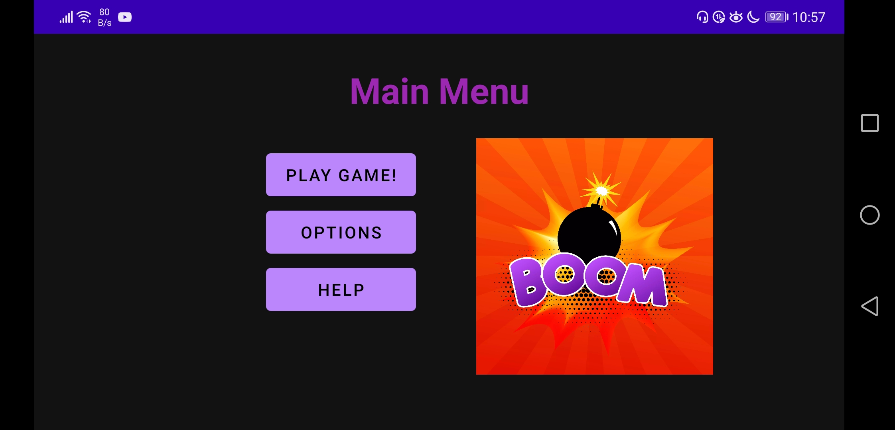
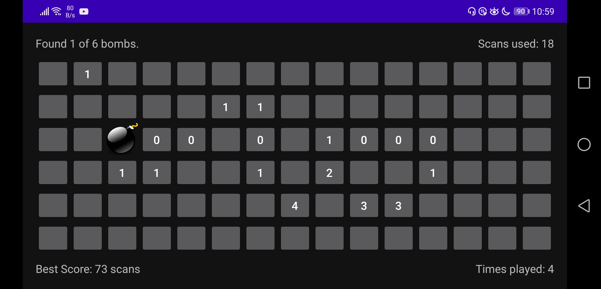
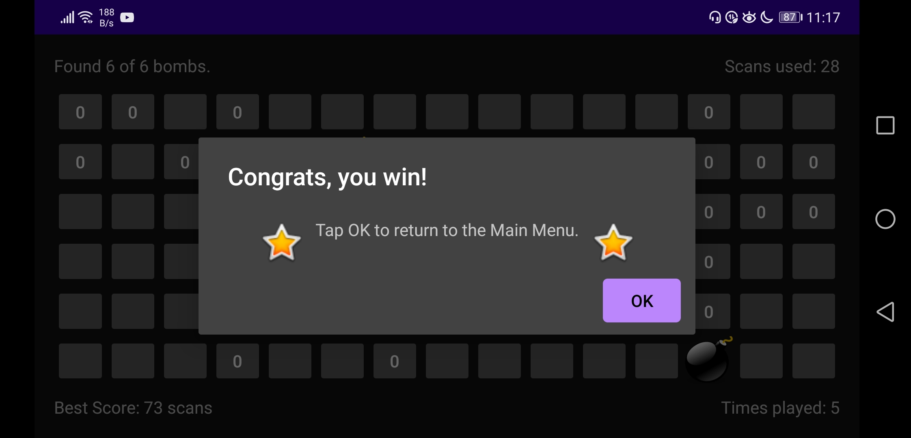
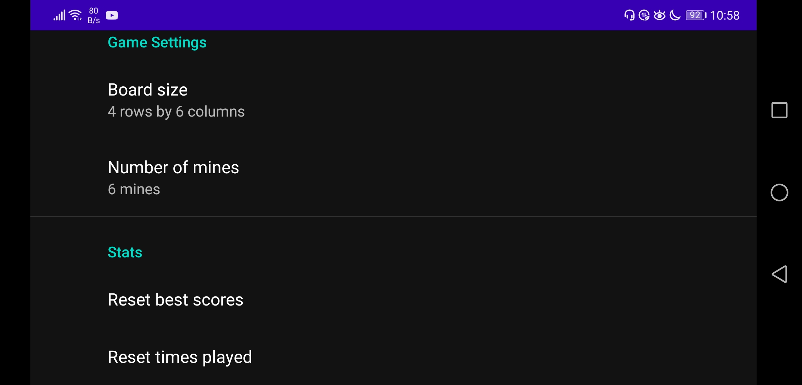
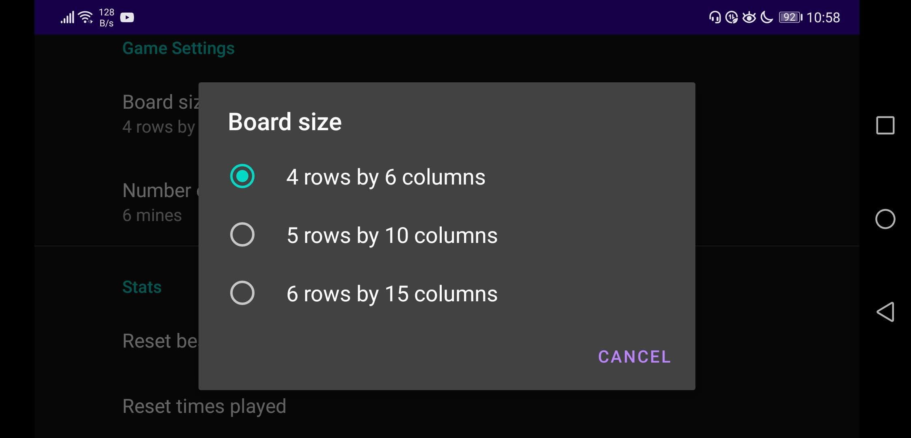

# mineseeker-app
Mineseeker is an Android game similar to Minesweeper. However, instead of avoiding the mines, the goal is to reveal all mines in the fewest moves possible.

## Installation

1. Clone this repository and import into **Android Studio**
   ```bash
   git clone git@github.com:01mz/mineseeker-app.git
   ```

## Screenshots
Gameplay
<br> 








<br>
 Settings
<br>



